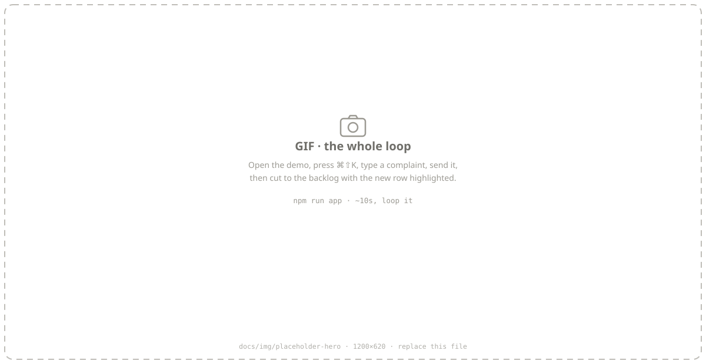
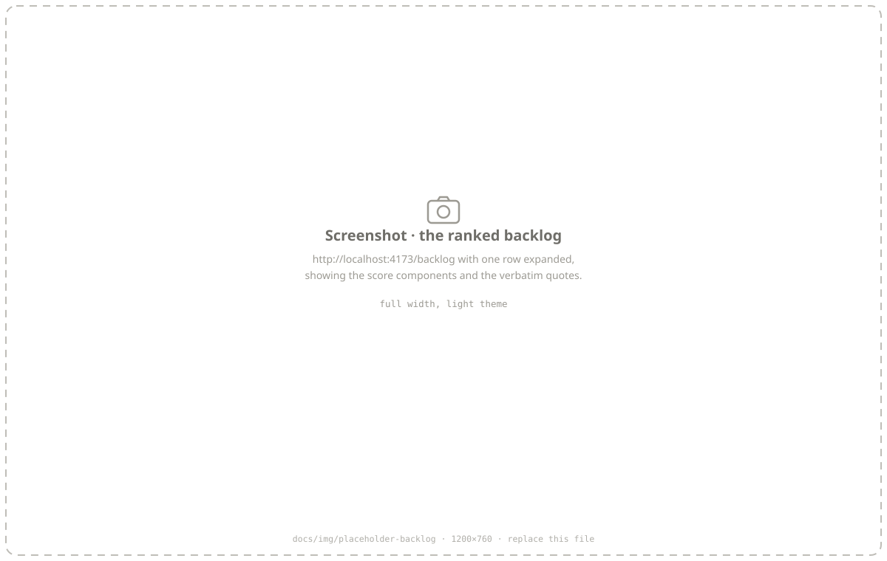
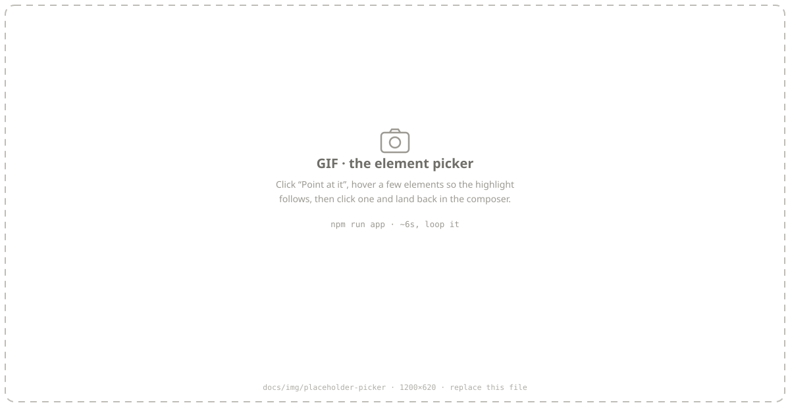

<div align="center">

# Quorum

**Know what's important.** Quorum turns scattered user feedback into a ranked,
defensible answer to *"what should we build next?"*

*enough voices to make a decision legitimate*

[Quickstart](#see-it-work) · [At scale](#at-scale) · [Status](#status) · [Design docs](#design-docs) · [ADRs](docs/adr/)

</div>

<!--
  PLACEHOLDER — replace docs/img/placeholder-hero.svg with a GIF or PNG of the
  same name (or change the src). See docs/img/README.md for the shot list.
-->
<p align="center">
  
</p>

---

## The idea in one picture

Four channels in — a web widget, a mobile shake, your support inbox, backend
exceptions — one canonical store, and a ranked list with the evidence attached.

<picture>
  <source media="(prefers-color-scheme: dark)" srcset="docs/img/northwind-pipeline-dark.svg">
  
</picture>

**Not a bug tracker.** Bugs are one input among feature requests, confusion,
praise and support tickets — they all feed one ranked answer.

1. **Aggregate and rank.** "Add dark mode," "the app hurts my eyes at night"
   and "why is everything white" are one line item, ordered by weighted unique
   users and growth rate rather than by whoever upvoted loudest.
2. **Capture.** A corner nub, a keyboard shortcut, an element picker that says
   *which component* is broken, rage-shake on mobile, and passive frustration
   detection — without ever throwing a modal at someone who is already annoyed.
3. **Close the loop.** Open the Linear/Jira/GitHub issue with the spec, the
   quotes, the affected user count and the repro attached. *(Planned.)*

Capture is not a separate product — it is what makes the ranking trustworthy.
Route, app version, account weight and frustration intensity are all ranking
signals a plain feedback form cannot produce.

---

## See it work

No install, no build step, no API key.

```bash
npm run app     # the demo product, its widget, and the ranked backlog
```

<!-- PLACEHOLDER — swap docs/img/placeholder-backlog.svg for a real screenshot. -->
<p align="center">
  
</p>

A fake B2B product on `:4173` with `<quorum-nub>` in it, the real ingest
service on `:8787`, and the backlog at `/backlog` — seeded with 428 pieces of
feedback. Worth trying, in order:

- **Send something about dark mode.** It clusters into the existing dark-mode
  issue instead of making a new row.
- **Switch user, top right.** That calls `identify(id, { mrr })`. File the same
  feedback as a $9,400/mo account and as a free one, and watch the list reorder.
- **Go offline and submit.** The panel says *saved, we'll send it when you're
  back online* — because that is what happened. Reconnect and it flushes.
- **Press "Point at it"** and click any element. The submission carries a
  selector that resolves back to it, plus the computed styles that explain why
  it might be broken.

<!-- PLACEHOLDER — swap docs/img/placeholder-picker.svg for a GIF of the picker. -->
<p align="center">
  
</p>

Prefer a terminal? `npm run demo` imports a support-inbox CSV and prints a
ranked backlog in about a second. The whole integration is two calls:

```ts
const quorum = new Quorum({ projectId: 'acme-web' })
await quorum.importCsv(csv, { source: 'support_inbox' })

const issues = await quorum.issues({ now: new Date(), limit: 10 })
```

---

## At scale

`npm run northwind` runs the pipeline over 428 submissions from 161 accounts
across 120 days and six releases.

```
  submissions   428          issues found    59
  accounts      161          compression     7.3×
  assign on write 29ms       rank + explain  352ms
```

<picture>
  <source media="(prefers-color-scheme: dark)" srcset="docs/img/northwind-ranked-dark.svg">
  
</picture>

No LLM is involved. Titles are the **medoid submission** — a real sentence a
real user wrote — and every number decomposes into inputs you can check.

### Revenue weighting, isolated

Same clustering, same recency, same growth; only the account-weight term
changes. Log-scaled, so a $10k/month account counts as roughly three users
rather than a hundred — revenue orders the list without owning it
([ADR-0015](docs/adr/0015-log-scaled-account-weight.md)).

<picture>
  <source media="(prefers-color-scheme: dark)" srcset="docs/img/northwind-weighting-dark.svg">
  
</picture>

The biggest mover rises four places. Nothing moves ten, which is the point:
this is a reweighting, not a different product.

### A regression, and the release that caused it

<picture>
  <source media="(prefers-color-scheme: dark)" srcset="docs/img/northwind-regression-dark.svg">
  
</picture>

Every report carries a route and an app version because
[PROTOCOL.md](docs/PROTOCOL.md) makes both first-class fields rather than
metadata soup. That is what lets a row read *"12 reports from /mobile/capture,
4.12.0, in 72 hours"* instead of *"12 reports"*.

### And what it gets wrong

The report prints its own failures, because a demo that only shows its good
side is an advertisement:

```
  "dashboard-slow" reached the top 10 as 3 separate rows:
      · Everything hangs for ages before the charts appear.
      · I make a coffee while the home screen loads.
      · Performance has fallen off a cliff in the last month.
```

Three sentences about one problem, sharing no content words. TF-IDF cosine
cannot merge them at any threshold — that is the gap embeddings exist to close,
and why they are in v0.1.

> **That corpus is synthetic**, and it bounds what these figures prove: the
> system *runs* at this scale, not that it clusters *accurately*. Quality is
> measured against a separate labeled corpus in [`packages/eval`](packages/eval),
> and replacing that one with real data is the highest-leverage task on the
> roadmap. It has still earned its keep — running it caught a shipped default
> that was over-merging badly
> ([ADR-0024](docs/adr/0024-consolidation-threshold-retuned.md)).

---

## Status

Early, and further along than most things at this stage. **1,158 tests, zero
runtime dependencies.**

| Package | State |
| --- | --- |
| `@quorum/core` | ✅ Protocol, ULID keys, durable offline queue, transport with the full error table, panel state machine, PII redaction |
| `@quorum/aggregate` | ✅ TF-IDF clustering, write-time assignment, offline consolidation, split/outlier proposals, SimHash/LSH, explainable ranking |
| `@quorum/node` | ✅ CSV/inbox import, exception capture, protocol ingest, ranked read API |
| `@quorum/api` | ✅ `node:http` ingest + read, durable append-only log, rate limiting. **Not Postgres** |
| `@quorum/web` | ✅ `<quorum-nub>` wired end to end — identify, route/version tagging, redaction, offline queue, element picker, frustration detection. Rendering covered by a 26-test browser suite driving a real Chrome — green in CI on every push |
| `@quorum/eval` | ✅ Labeled corpus, clustering + rank-agreement metrics, hybrid embedding sweep |
| `@quorum/react` | ⛔ Not started |

**The measurement gap.** No real embedding model has ever been run through the
sweep, so the ranked list recovers 5 of the correct top 10 against a proven
ceiling of 10/10. The harness is built and waiting: `ollama pull
nomic-embed-text`, three env vars, and `npm run eval` answers it
([how](packages/eval/README.md#unblocking-this-in-five-minutes)).

**The other gap, worth saying plainly:** nothing here has been used by a real
person. Every layer is tested and the DOM layer runs in a real browser on every
push — but tests are not users, and no claim on this page rests on anyone
having tried it.

**Not built:** framework wrappers, DOM capture, presigned capture upload,
merge/split review UI, Postgres, the write-back integrations.

Six roadmap assumptions have been overturned by measurement rather than
argument — [ADRs 0013, 0014, 0018, 0019, 0023, 0024](docs/adr/).

---

## Why not just a feedback board

- **Weighted prioritization, not vote counts.** Raw upvotes are a popularity
  contest. Join feedback to plan tier and MRR and the top items become
  revenue-weighted.
- **Every input in one place.** Widget submissions, rage shakes, backend
  exceptions and support text cluster *against each other*. Feedback boards are
  web-first; crash SDKs own shake-to-report but rank nothing. Nobody sits in
  the middle.
- **Evidence, not vibes.** Every ranked row drills to the quotes that produced
  it. A ranked list you cannot interrogate is one nobody believes.
- **Bring-your-own-model and self-host.** The clustering and ranking core is
  fully deterministic and the LLM sits at the render edge, so "we can't send
  customer feedback to a third party" stops being a dealbreaker.

## Target integration

```html
<script src="https://cdn.quorum.dev/v0/quorum.js" data-project="pk_live_..." defer></script>
```

```ts
quorum.identify(user.id, { plan: 'enterprise', mrr: 4000 })   // makes ranking revenue-weighted
```

Theming is CSS custom properties, never a config object:

```css
quorum-nub { --quorum-accent: #7c3aed; --quorum-radius: 12px; }
```

## Repository layout

```
packages/
  core/        protocol, ULID, offline queue, transport, redaction, logging
  aggregate/   clustering, write-time assignment, ranking, embedders. Zero deps.
  node/        import, exception capture, protocol ingest, ranked read API
  web/         <quorum-nub> + browser client, element picker, frustration
  eval/        labeled corpus, metrics, baselines, embedding sweep
services/api/  node:http ingest + read, append-only store, rate limiting
tools/         dev-only: CDP browser driver, TS-stripping dev server, size gate
examples/
  support-inbox/  CSV in, ranked backlog out — a 30-second read
  saas-app/       the whole loop: widget → ingest → dashboard
  northwind/      428 submissions — the pipeline at scale, and these figures
```

```bash
npm test              # 1,158 tests, no install required
npm run app           # the demo product + ingest + ranked backlog
npm run demo          # import a support inbox, print a ranked backlog
npm run northwind     # the pipeline at scale; regenerates the figures above
npm run eval          # clustering baselines + rank agreement
npm run mock-model    # a fake embeddings endpoint, to check your config first
npm run size          # the 15KB budget — 13.0KB today, as an upper bound
npm run test:browser  # the DOM suite; needs a Chromium-family browser
```

## Design docs

| Doc | What's in it |
| --- | --- |
| [ARCHITECTURE.md](docs/ARCHITECTURE.md) | System shape, integration layers, the aggregation pipeline |
| [DATA-MODEL.md](docs/DATA-MODEL.md) | Canonical-issue store, incremental centroids, ranking, render cache |
| [PROTOCOL.md](docs/PROTOCOL.md) | The capture envelope — the contract that outlives the packages |
| [PRIVACY.md](docs/PRIVACY.md) | Redaction defaults, enterprise posture, non-goals |
| [ROADMAP.md](docs/ROADMAP.md) | Sequencing, and what's deliberately deferred |
| [TESTING.md](docs/TESTING.md) | How a repo with no dependencies tests a browser widget |
| [adr/](docs/adr/) | 25 decision records — what we chose, and what would change our mind |

The ones that shape everything else:

- [Prioritization is the product](docs/adr/0012-prioritization-is-the-product.md) — the first session ends with a ranked list, not a feed
- [Deterministic core, LLM at the render edge](docs/adr/0005-deterministic-core-llm-at-render-edge.md) — reproducible, auditable, self-hostable
- [Redact by default](docs/adr/0007-redact-by-default.md) — a pipeline that's safe only when configured correctly is unsafe
- [Rank agreement is the eval target](docs/adr/0014-rank-agreement-is-the-eval-target.md) — tuning on ARI picks a measurably worse list
- [...and its conflation guard](docs/adr/0023-rank-agreement-needs-a-conflation-guard.md) — because that metric pays for over-merging
- [Never interrupt the frustrated user](docs/adr/0010-never-interrupt-the-frustrated-user.md) — the fastest way to turn frustration into uninstallation
- [Verify the DOM layer over CDP](docs/adr/0022-verify-the-dom-layer-over-cdp.md) — no registry access, but a browser was already installed

## Constraints we hold ourselves to

- **≤15KB gzipped** for core + nub — **13.0KB today**, measured as an upper
  bound, with the picker and frustration detection lazy-loaded. CI fails on
  regression.
- **Free by default.** No API key, no account, no spend. No test makes a
  network call.
- **No model identifier anywhere in the source tree.** Models are config, so a
  deprecation is an `.env` edit rather than a commit.
- **Zero runtime dependencies.** Tests use Node's built-in runner; there is no
  framework to install either.
- **No screen-share prompt, ever.** We serialize the DOM.
- **Every ranked row is explainable** down to the verbatim quotes.
- **Additive-only protocol changes** within a major version.

## Open questions

- npm scope `@quorum/*` availability is **unverified**. Fallbacks: `@quorumhq/*`,
  `@usequorum/*`, `quorum-sdk`.
- Ranking depends on `account_weight`, which needs `identify()` with meaningful
  traits. What is the fallback for a team that will not wire revenue data in?
- Self-host packaging: Docker Compose only, or a Helm chart too?

**v1 is web components + React wrapper + native iOS.** Everything else waits
for someone to ask — see [scope discipline](docs/ROADMAP.md#the-failure-mode-to-watch).

## License

MIT. See [LICENSE](LICENSE).
